<h1 align="center">Hi 👋, I'm Blueberry</h1>
<h3 align="center">Software Engineer</h3>

A skillful full-stack engineer who is fitting for most of things from basic web apps to intricate high-performance systems.

Well-versed in popular and modern technology stacks and related technologies, with expertise in building complex systems from scratch and maintaining existing codebases. This engineer has a strong desire for continuous learning and integration of new techniques to enhance their skills and stay up-to-date.

Additionally, this individual enjoys the flexibility and comfort of working remotely from home.

<!-- 
  
 -->

<!-- - 👨‍💻 All of my projects are available at [https://discord.com/users/1060016406810349671](https://discord.com/users/1060016406810349671) -->

<!-- - 📄 Know about my experiences [https://discord.com/users/1060016406810349671](https://discord.com/users/1060016406810349671) -->

<h3 align="left">Connect with me:</h3>

# 💻 I'm a Native Speaker in these languages

<table align="center">
  <tr>
    <td align="center" width="96">
        
       JavaScript
    </td>
    <td align="center" width="96">
        
       TypeScript
    </td>
    <td align="center" width="96">
        
     PHP
    </td>
    <td align="center" width="96">
      
       Python
    </td>
    <td align="center" width="96">
        
       Solidity
    </td>
    <td align="center" width="96">
        
       Dart
    </td>
    <td align="center"  width="96">
        
       HTML5
    </td>
    <td align="center" width="96">
        
       CSS
    </td>
    </tr>
    <tr>
    <td align="center" width="96">
        
       C++
    </td>
    <td align="center" width="96">
        
       C#
    </td>
    <td align="center" width="96">
        
       Java
    </td>
    <td align="center" width="96">
        
       Golang
    </td>
    <td align="center" width="96">
        
       Rust
    </td>
    <td align="center" width="96">
        
       Ruby
    </td>
    <td align="center" width="96">
        
       SQL
    </td>
    <td align="center" width="96">
        
       NoSQL
    </td>
  </tr>
</table>

<!-- 

 -->

<!-- 
&nbsp;
 -->

